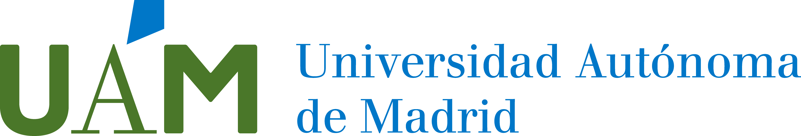
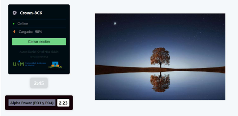

# 🚀 TFG - Daniel Oriol Niso Galán

**"Desarrollo e implementación de un sistema de neurofeedback para EEG inalámbrico"**

Junio 2024

GRADO EN INGENIERÍA DE TECNOLOGÍAS Y SERVICIOS DE TELECOMUNICACIÓN

Escuela Politécnica Superior - Universidad Autónoma de Madrid

- Autor: Daniel Oriol Niso Galán
- Tutora: Julia Guiomar Niso Galán
- Ponente: Aythami Morales Moreno

  

  

### Instalar la aplicación

Para instalar la aplicación web de neurofeedback, debes realizar los siguientes pasos a continuación:

- 1️⃣ `git clone https://github.com/Engas027/TFG_2023_ONG.git`
- 2️⃣ `cd app-nfb`
- 3️⃣ `npm install`
- 4️⃣ `npm start`

De esta manera se ejecutará la aplicación asociada al dispositivo de EEG Neurosity de manera local.
Puedes ver más detalles sobre su funcionamiento en el repositorio OSF asociado al proyecto:
https://osf.io/qfzvm

MIT License
